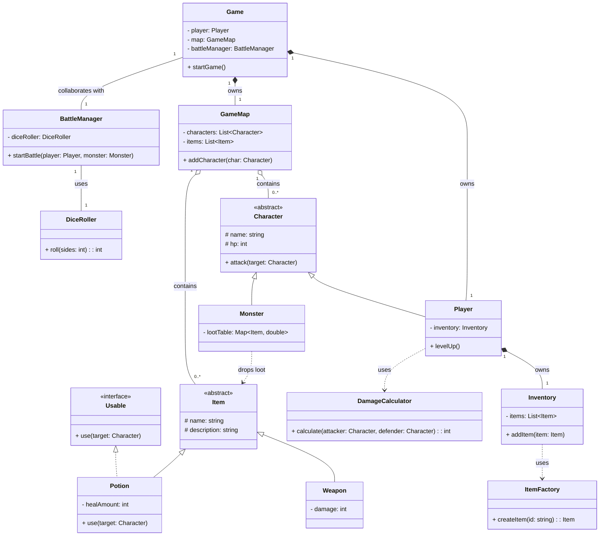
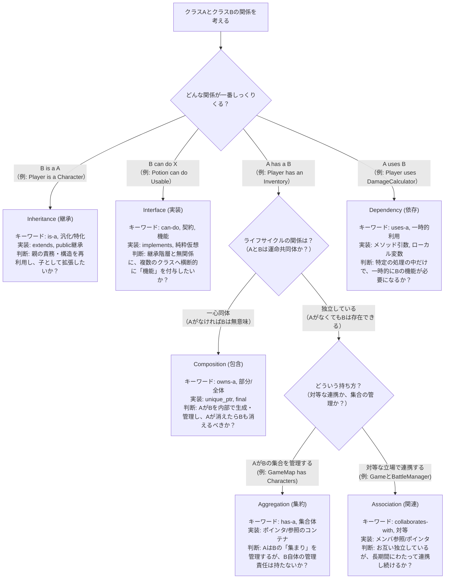

### オブジェクト指向設計：主要なクラス関係性リファレンス (テキストRPG構築編)

---
**オブジェクト指向設計における主要なクラス・インターフェース関係性を、CUI（キャラクターユーザーインターフェース）ベースのテキストRPGという、直感的で理解しやすいアプリケーションの実装レベルで理解するためのリファレンスです。**

 **【エンジニア向け解説】 なぜクラス関係性が重要なのか？**

> 我々が開発するソフトウェアは、多数のコンポーネント（クラス）の集合体です。シンプルなテキストRPGでさえ、「プレイヤー」「モンスター」「アイテム」「マップ」など、様々な責務を持つ部品から成り立っています。これらの部品を**いかに疎結合かつ高凝集に設計するか**が、システムの保守性、拡張性、そしてテストの容易性を決定づけるからです。このリファレンスでは、その部品同士の「つなぎ方」のパターンを学び、より堅牢な設計判断を下すための武器を身につけます。

C++とJavaを中心に、実務で頻出する6つの関係性（Inheritance, Interface, Composition, Aggregation, Association, Dependency）の違いを、具体的なシナリオを通して解説します。

---

### テキストRPGの簡易アーキテクチャ設計例

実際の開発をイメージしやすいように、テキストRPGの内部構造をモデルケースに採用しました。複数の関係性がどのように組み合わさって一つのアプリケーションを形成するのか、その全体像を掴むことを目指します。

#### 主要コンポーネント

| コンポーネント | 役割 | 身近な実装例 |
| :--- | :--- | :--- |
| **Game** | ゲーム全体の進行を管理するメインループ。 | `main`関数や、ゲームセッション全体を管理するオブジェクト。 |
| **Character** | プレイヤーやモンスターの基本となる抽象クラス。 | ゲームに登場するキャラクターの基底概念。 |
| **Player** | ユーザーが操作するキャラクター。 | 主人公。`Character`を具体化したもの。 |
| **Monster** | プレイヤーの敵となるキャラクター。 | スライム、ドラゴンなど。これも`Character`の一種。 |
| **Item** | 武器やポーションなど、ゲーム内アイテムの基底クラス。 | 「どうのつるぎ」や「やくそう」の元となる概念。 |
| **Inventory** | `Player`が`Item`を保持・管理するための部品。 | プレイヤーの「どうぐぶくろ」。 |
| **GameMap** | `Character`や`Item`が存在する空間。 | 「はじまりの森」や「まおうのしろ」といったフィールド。 |

#### クラス関係図 (テキストRPG版)



---

### 各関係性の実装パターン (テキストRPG版)

#### 1. Inheritance（継承）
**特徴**: **"is-a"（～は～の一種である）**。基本となるクラス（親）の特性を、派生クラス（子）が受け継ぐ関係。`Player`と`Monster`が共に`Character`であるように、共通の基盤と、それぞれに特化した性質を持つ階層構造に最適です。

**例**: `Player`と`Monster`は、どちらも`Character`の一種です。

```cpp
// C++: 抽象基底クラスとしてキャラクターの基本を定義
class Character {
protected:
    std::string name;
    int hp;
public:
    virtual void attack(Character& target) = 0; // 純粋仮想関数
    virtual ~Character() = default;
};

// Characterを継承してPlayerを定義
class Player : public Character {
public:
    void attack(Character& target) override { /* プレイヤーの攻撃処理 */ }
};
```

```java
// Java: abstractクラスで共通のインターフェースを定義
abstract class Character {
    protected String name;
    protected int hp;
    public abstract void attack(Character target);
}

// CharacterをextendsしてPlayerを実装
class Player extends Character {
    @Override
    public void attack(Character target) { /* プレイヤーの攻撃処理 */ }
}
```

#### 2. Interface（インターフェース実装）
**特徴**: **"can-do"（～できる）**。特定の「機能セット」をクラスに契約させる仕組み。継承関係にないクラス群に「使用可能」のような共通の振る舞いを横断的に付与したい場合に用います。

**例**: `Potion`（ポーション）や`SpellBook`（魔法の書）は種類が違えど、どちらも「使用可能(`Usable`)」という共通の機能を持てます。

```cpp
// C++: 純粋仮想クラスでインターフェースを定義
class Usable {
public:
    virtual void use(Character& target) = 0;
    virtual ~Usable() = default;
};

// Itemを継承し、Usableインターフェースを実装
class Potion : public Item, public Usable {
public:
    void use(Character& target) override { /* 対象のHPを回復する処理 */ }
};
```

```java
// Java: interfaceキーワードで機能セットを定義
interface Usable {
    void use(Character target);
}

// Itemを継承しつつ、Usable機能をimplementsで実装
class Potion extends Item implements Usable {
    @Override
    public void use(Character target) { /* 対象のHPを回復する処理 */ }
}
```

#### 3. Composition（コンポジション／包含）
**特徴**: **"owns-a"（～を所有する）**。パーツ（部分）のライフサイクルが、全体に完全に依存する強い所有関係です。「全体」が消滅すれば、「部分」も一緒に消滅します。

**例**: `Player`は自身の`Inventory`（どうぐぶくろ）を所有します。プレイヤーキャラクターがゲームから削除されれば、そのどうぐぶくろも一緒に消滅します。

```cpp
// C++: unique_ptrで所有権を明確化
class Player {
private:
    // Playerは自身のInventoryを生成・所有する
    std::unique_ptr<Inventory> inventory;
public:
    Player() {
        this->inventory = std::make_unique<Inventory>();
    }
    // Playerのデストラクタでinventoryも自動的に解放される
};
```

```java
// Java: finalフィールドとして宣言し、インスタンス生成時に初期化
class Player {
    // プレイヤーは自身のどうぐぶくろを所有する
    private final Inventory inventory;

    public Player() {
        // 外部からは差し替えられない
        this.inventory = new Inventory();
    }
    // PlayerインスタンスがGCされると、inventoryもGCの対象となる
}
```

#### 4. Aggregation（アグリゲーション／集約）
**特徴**: **"has-a"（～を持つ）**。パーツが全体から独立して存在できる、弱い所有関係です。「全体」は「部分」の集合を管理しますが、ライフサイクルは独立しています。

**例**: `GameMap`は、そのマップ上にいる`Character`（プレイヤーやモンスター）の集合を管理します。しかし、キャラクターがマップ間を移動しても、キャラクター自体が消滅するわけではありません。

```cpp
// C++: 所有権を移譲しないポインタやshared_ptrで管理
class GameMap {
private:
    // CharacterのライフサイクルはGameMapに依存しない
    std::vector<std::shared_ptr<Character>> characters;
public:
    void addCharacter(std::shared_ptr<Character> character) {
        characters.push_back(character);
    }
};
```

```java
// Java: Listで参照を保持する
class GameMap {
    // Characterの参照をリストで管理
    private final List<Character> characters;

    public GameMap() {
        this.characters = new ArrayList<>();
    }
    public void addCharacter(Character character) {
        this.characters.add(character);
    }
}
```

#### 5. Association（関連）
**特徴**: **対等な関係**。互いに独立したライフサイクルを持つオブジェクト同士が、長期間にわたって連携する関係です。所有関係はなく、互いをサービスの利用者として参照します。

**例**: `Game`オブジェクトは、ゲームの進行に応じて`BattleManager`（戦闘管理サービス）を利用します。両者はゲーム実行中、長期的に存在する独立したコンポーネントです。

```cpp
// C++: メンバとして相手へのポインタや参照を保持
class Game {
private:
    BattleManager* battleManager; // 外部から参照を受け取る
public:
    Game(BattleManager* manager) : battleManager(manager) {}
    
    void triggerBattle(Player& player, Monster& monster) {
        // 戦闘管理サービスに処理を依頼する
        battleManager->startBattle(player, monster);
    }
};
```

```java
// Java: メンバ変数として相手の参照を保持
class Game {
    // DIなどで外部から設定される
    private final BattleManager battleManager;

    public Game(BattleManager battleManager) {
        this.battleManager = battleManager;
    }
    public void triggerBattle(Player player, Monster monster) {
        battleManager.startBattle(player, monster);
    }
}
```

#### 6. Dependency（依存）
**特徴**: **一時的な利用関係**。あるクラスのメソッドが、処理の実行中だけ別のクラスを一時的に利用する関係。メソッドの引数で受け取るか、メソッド内でインスタンス化して使い捨てるのが典型です。

**例**: `Player`が`attack`メソッドを実行する際、そのメソッド内でのみ`DamageCalculator`を利用してダメージ計算を行います。計算が終われば、`DamageCalculator`は不要になります。

```cpp
// C++: メソッド内でのみインスタンス化
class Player : public Character {
public:
    void attack(Character& target) override {
        // このスコープ内でのみ計算機を利用する
        DamageCalculator calculator;
        int damage = calculator.calculate(*this, target);
        // ...ダメージを与える処理...
    }
};
```

```java
// Java: メソッドローカル変数として利用
class Player extends Character {
    @Override
    public void attack(Character target) {
        // attackメソッドの実行中だけ計算機を一時的に利用
        DamageCalculator calculator = new DamageCalculator();
        int damage = calculator.calculate(this, target);
        // ...ダメージを与える処理...
    }
}
```
---

### 実装時の判断フロー

クラス間の関係性をどう選ぶか迷ったとき、このフローチャートを参考に思考を整理してみましょう。



---

### 関係性の組み合わせパターン

実際のシステムは、複数の関係性を柔軟に組み合わせることで、現実に即した堅牢な設計になります。

#### パターン1: 階層構造（継承） + 機能分離（インターフェース）
キャラクターの基本構造を**継承**で作り、特定のアイテムに「使用可能」という機能を**インターフェース**で分離して実装する、王道パターンです。

**例**: `Character`という基本構造を**継承**した`Player`が、`Usable`という**インターフェース**を実装した`Potion`を使用する。

```cpp
// C++
// 機能 (can-do)
class Usable { public: virtual void use(Character& c) = 0; virtual ~Usable() = default; };
// 階層構造 (is-a)
class Item { /*...*/ };
class Potion : public Item, public Usable {
public:
    void use(Character& c) override { /* 回復処理 */ std::cout << "Player used a potion." << std::endl; }
};
```
```java
// Java
// 機能 (can-do)
interface Usable { void use(Character target); }
// 階層構造 (is-a)
abstract class Item { /*...*/ }
class Potion extends Item implements Usable {
    @Override
    public void use(Character target) { /* 回復処理 */ System.out.println("Player used a potion."); }
}
```

#### パターン2: 集約 + 依存の組み合わせ
オブジェクトの集合を管理（**集約**）しつつ、その集合に対する操作のために、別の処理クラスを一時的に利用（**依存**）するパターンです。

**例**: `Game`が`GameMap`上の`Monster`の集合を管理し、「戦闘開始」の際に`BattleSequence`クラスを一時的に利用して戦闘処理を行う。

```cpp
// C++
class Game {
private:
    GameMap map; // Aggregation
public:
    void checkForBattle(Player& player) {
        if (map.hasMonsterNear(player)) {
            Monster& monster = map.getNearestMonster(player);
            // BattleSequenceを一時的に利用 (Dependency)
            BattleSequence battle(player, monster);
            battle.run();
        }
    }
};
```
```java
// Java
class Game {
    private GameMap map; // Aggregation
    public void checkForBattle(Player player) {
        if (map.hasMonsterNear(player)) {
            Monster monster = map.getNearestMonster(player);
            // BattleSequenceを一時的に利用 (Dependency)
            BattleSequence battle = new BattleSequence(player, monster);
            battle.run();
        }
    }
}
```

#### パターン3: コンポジション + 関連
コンポーネント内部の部品を**コンポジション**で隠蔽しつつ、その部品が外部の独立したサービスと**関連**を持って連携するパターンです。

**例**: `Player`は`Inventory`を**所有（コンポジション）**し、`Inventory`が`ItemDatabase`サービスと**連携（関連）**してアイテム情報を取得する。

```cpp
// C++
class Player {
private:
    // InventoryはPlayerが所有する (Composition)
    std::unique_ptr<Inventory> inventory;
public:
    Player(ItemDatabase* db) {
        // 内部部品に外部サービスを渡す
        this->inventory = std::make_unique<Inventory>(db);
    }
};
// InventoryはItemDatabaseと連携する (Association)
class Inventory {
private:
    ItemDatabase* db; // 非所有ポインタ
public:
    Inventory(ItemDatabase* db) : db(db) {}
};
```
```java
// Java
class Player {
    // InventoryはPlayerが所有する (Composition)
    private final Inventory inventory;
    public Player(ItemDatabase db) {
        // 内部部品に外部サービスを渡す
        this->inventory = new Inventory(db);
    }
}
// InventoryはItemDatabaseと連携する (Association)
class Inventory {
    private final ItemDatabase db; // メンバ変数として保持
    public Inventory(ItemDatabase db) { this.db = db; }
}
```
---
#### パターン4: ファクトリーパターン（依存 + 継承/インターフェース）
**概要**: オブジェクトの生成プロセスを専門のクラス（ファクトリー）にカプセル化するパターン。これにより、呼び出し元は具体的なクラス名を知ることなく、抽象的なインターフェースや基底クラスにのみ依存してオブジェクトを取得できます。

**シナリオ**: `GameMap`が、エリアの難易度に応じて異なる種類の`Monster`を生成する。例えば「森」なら`Slime`、「洞窟」なら`Bat`を生成したいが、`GameMap`は具体的なモンスター名を知るべきではありません。

*   `GameMap`は`MonsterFactory`に**依存**します。
*   `MonsterFactory`は、リクエストに応じて`Slime`や`Bat`といった、`Monster`を**継承**した具体的なインスタンスを生成して返します。

```cpp
// C++
// ファクトリーは、生成するモンスターの基底クラスにのみ依存
class MonsterFactory {
public:
    // 難易度に応じて適切なモンスターを生成して返す
    static std::unique_ptr<Monster> createMonster(std::string difficulty) {
        if (difficulty == "easy") return std::make_unique<Slime>();
        if (difficulty == "normal") return std::make_unique<Goblin>();
        return nullptr;
    }
};

// 呼び出し元 (GameMapなど) はファクトリーに生成を依頼する (依存)
class GameMap {
public:
    void spawnMonsters() {
        // 具体的なSlimeやGoblinクラスを知らなくても生成できる
        monsters.push_back(MonsterFactory::createMonster("easy"));
    }
};
```
```java
// Java
// ファクトリークラス
class MonsterFactory {
    // 戻り値は抽象的なMonster型
    public static Monster createMonster(String difficulty) {
        if ("easy".equals(difficulty)) return new Slime();
        if ("normal".equals(difficulty)) return new Goblin();
        return null;
    }
}

// 呼び出し元
class GameMap {
    public void spawnMonsters() {
        // MonsterFactoryを利用してモンスターを生成 (依存)
        monsters.add(MonsterFactory.createMonster("easy"));
    }
}
```
**実務上のメリット**: 新しいモンスター（例: `Dragon`）を追加する際、`MonsterFactory`を修正するだけで済み、`GameMap`などの呼び出し元のコードを一切変更する必要がありません。オブジェクトの生成ロジックを一元管理でき、保守性が向上します。

---

#### パターン5: ストラテジーパターン（関連/コンポジション + インターフェース）
**概要**: アルゴリズム（戦略）の集合をそれぞれクラスとして定義し、実行時にクライアントが動的に戦略を切り替えられるようにするパターンです。

**シナリオ**: `Monster`の行動パターン（AI）を、状況に応じて切り替えたい。「通常モード」では通常攻撃のみ、「激昂モード」では強力なスキルを多用する、といった振る舞いを実装します。

*   `Monster`は、`AIStrategy`**インターフェース**への**関連（またはコンポジション）**を持ちます。
*   `NormalModeAI`や`BerserkModeAI`が、`AIStrategy`**インターフェース**を実装した具体的な戦略クラスとなります。
*   `Monster`は、自身のHPが減るなどの条件に応じて、保持している戦略オブジェクトを差し替えます。

```cpp
// C++
// 戦略のインターフェース
class AIStrategy {
public:
    virtual void execute(Monster& self, Player& target) = 0;
    virtual ~AIStrategy() = default;
};

// Monsterは戦略を所有し、実行時に利用する (コンポジション/関連)
class Monster : public Character {
private:
    std::unique_ptr<AIStrategy> strategy;
public:
    Monster() : strategy(std::make_unique<NormalModeAI>()) {}
    void takeTurn(Player& target) {
        strategy->execute(*this, target);
        if (this->hp < 50) {
            // HPが減ったら戦略を切り替える
            this->strategy = std::make_unique<BerserkModeAI>();
        }
    }
};
```
```java
// Java
// 戦略のインターフェース
interface AIStrategy {
    void execute(Monster self, Player target);
}

// Monsterは戦略をメンバとして保持する (関連)
class Monster extends Character {
    private AIStrategy strategy = new NormalModeAI();

    public void setStrategy(AIStrategy strategy) {
        this->strategy = strategy;
    }

    public void takeTurn(Player target) {
        strategy.execute(this, target);
        if (this->hp < 50) {
            // HPが減ったら、外部から新しい戦略をセットしてもらう
            this->setStrategy(new BerserkModeAI());
        }
    }
}
```
**実務上のメリット**: 行動パターンの追加・修正が容易になります。新しいAI（例: `DefensiveModeAI`）を追加したい場合でも、`Monster`クラスのコードを変更することなく、新しい戦略クラスを作成するだけで対応できます。ロジックの再利用性も高まります。

---

#### パターン6: オブザーバーパターン（集約/関連 + インターフェース）
**概要**: あるオブジェクト（通知元, Subject）の状態変化を、それに依存する複数のオブジェクト（監視役, Observer）へ自動的に通知して更新させるパターンです。

**シナリオ**: `Player`がレベルアップした際に、複数の異なるコンポーネントがそのイベントを知る必要がある。例えば、`UIManager`は画面に「Level Up!」と表示し、`AchievementManager`は実績が解除されたかチェックし、`GameLogger`はそのイベントをログに記録します。

*   `Player`（Subject）は、`PlayerObserver`**インターフェース**のリストを**集約**します。
*   `UIManager`, `AchievementManager`, `GameLogger`などが、`PlayerObserver`**インターフェース**を実装した具体的な監視役クラスとなります。
*   `Player`はレベルアップした際、登録されている全ての監視役に通知メソッド（`notifyLevelUp`など）を呼び出します。

```cpp
// C++
// 監視役のインターフェース
class PlayerObserver {
public:
    virtual void onLevelUp(Player& player) = 0;
    virtual ~PlayerObserver() = default;
};

// 通知元は監視役のリストを保持する (集約)
class Player : public Character {
private:
    std::vector<PlayerObserver*> observers;
public:
    void addObserver(PlayerObserver* observer) { observers.push_back(observer); }
    void levelUp() {
        // ... レベルアップ処理 ...
        // 登録された全ての監視役に通知
        for (auto observer : observers) {
            observer->onLevelUp(*this);
        }
    }
};
```
```java
// Java
// 監視役のインターフェース
interface PlayerObserver {
    void onPlayerLevelUp(Player player);
}

// 通知元は監視役のリストを保持する (集約)
class Player extends Character {
    private final List<PlayerObserver> observers = new ArrayList<>();
    public void addObserver(PlayerObserver observer) { observers.add(observer); }

    public void levelUp() {
        // ... レベルアップ処理 ...
        // 登録された全ての監視役に通知
        for (PlayerObserver observer : observers) {
            observer.onPlayerLevelUp(this);
        }
    }
}
```
**実務上のメリット**: 通知元（`Player`）と通知先（`UIManager`など）を完全に分離（疎結合に）できます。「レベルアップ時に新しい処理を追加したい」という要望が出ても、`Player`クラスを一切変更せず、新しい`PlayerObserver`実装クラスを作成して登録するだけで対応可能です。これにより、関心事が異なるコンポーネント間の依存関係を排除できます。


---

### まとめ：なぜこの設計が実務で重要なのか？

ここまで見てきたクラス間の関係性は、単なる理論上のパターンではありません。これらを意識して設計することは、実務において極めて重要な意味を持ちます。

1.  **保守性の向上**: クラスの役割が明確になり、互いに疎結合であるほど、仕様変更や機能追加の影響範囲を限定できます。「ポーションの効果を変えたら、武器の攻撃ロジックが壊れた」といった事態を防ぎ、修正コストを大幅に削減します。

2.  **テストの容易化**: 各コンポーネントが独立していると、単体テストが非常に書きやすくなります。例えば`Inventory`のテストは、`Player`や`GameMap`から切り離して、アイテムの追加・削除ロジックだけに集中して検証できます。

3.  **チーム開発の円滑化**: 適切な関係性に基づいた設計は、**チームの共通言語**として機能します。「`Player`は`Inventory`を**コンポジション**で持つ」「`DamageCalculator`には**依存**するだけ」といった会話が成立することで、複数人での開発がスムーズに進みます。誰がどの部分を担当するかの分業もしやすくなります。

4.  **キャリアの成長**: オブジェクト指向の設計原則を深く理解し、実践できるエンジニアは、より複雑で大規模なシステムの設計・開発を任されるようになります。これは、単にコードを書けるだけでなく、**変更に強い構造を構築できる**という、一つ上のレベルのスキルを持っていることの証明です。

このリファレンスが、日々の実装において「なぜこのクラスとこのクラスを繋ぐのか」を論理的に判断し、より堅牢なソフトウェアを構築するための一助となれば幸いです。
